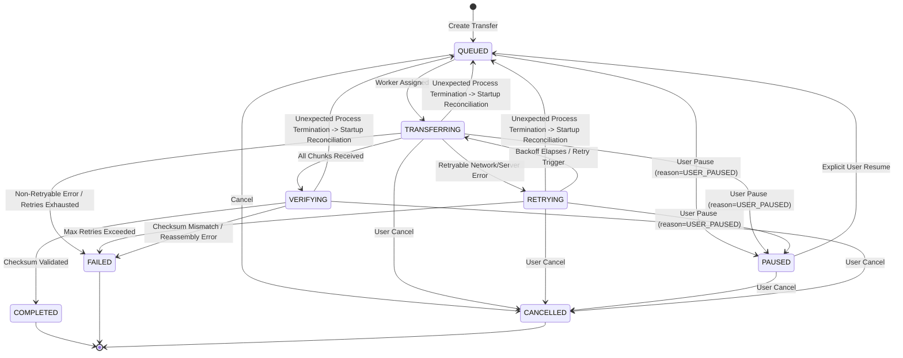
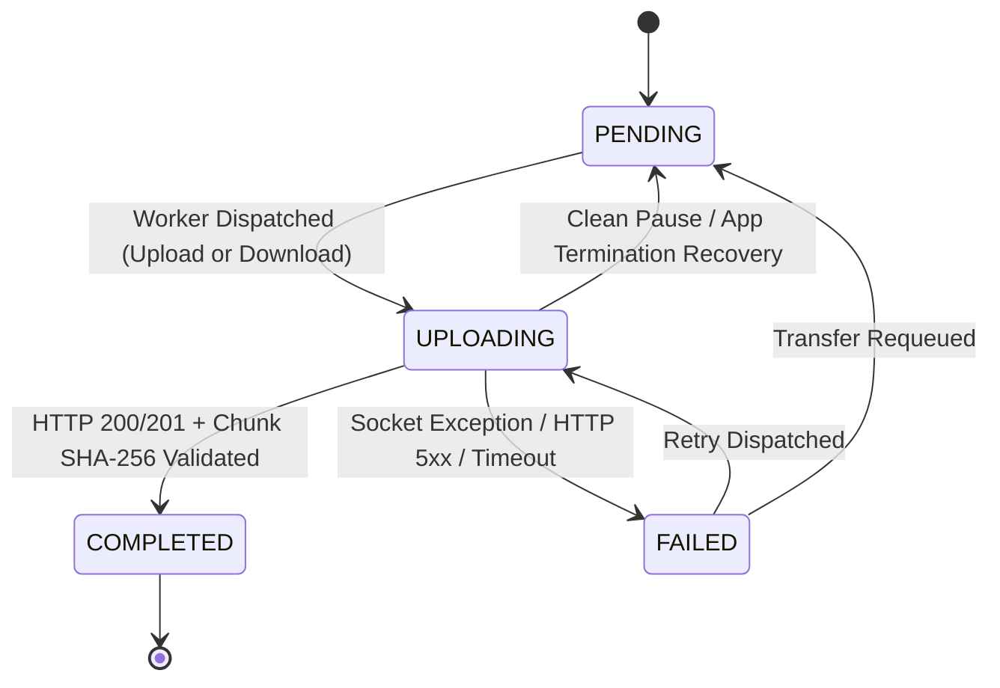

# Formal State Machine Specification

## 1. Overview

The Resumable Transfer Engine strictly decouples business and networking state from UI presentation. System execution is governed by two hierarchical, deterministic state machines:
1. **Transfer State Machine**: Controls the holistic lifecycle of a transfer entity (`TransferRecord`).
2. **Chunk State Machine**: Governs the granular upload/download progress of individual file segments (`ChunkRecord`).

No implicit boolean flags (e.g., `isUploading`, `hasError`, `isPaused`) are permitted. All transitions must be validated against the formal transition matrices defined herein.

---

## 2. Transfer State Machine

### 2.1 State Definitions

| State | Classification | Description |
| :--- | :--- | :--- |
| `QUEUED` | Passive | The transfer is registered and persisted in the local database. It is awaiting scheduling by the `TransferQueueManager`. Both new transfers and automatically recovered interrupted transfers enter this state. |
| `TRANSFERRING` | Active | The transfer is actively executing network operations. At least one chunk is either in-flight or actively being scheduled. |
| `PAUSED` | Passive | The transfer was deliberately halted by user action (`reason = USER_PAUSED`). In-flight requests were cleanly aborted and reset to `PENDING`. **Must NOT automatically resume on restart; requires explicit user Resume.** |
| `RETRYING` | Active Waiting | The transfer encountered a transient, retryable failure. It is waiting for an exponential backoff timer to expire before re-entering `TRANSFERRING`. |
| `VERIFYING` | Processing | All expected chunks have been transmitted. The engine (for download) or server (for upload) is calculating and verifying cryptographic integrity (SHA-256). |
| `COMPLETED` | Terminal (Success) | Cryptographic verification succeeded. File is assembled and validated. No further mutations permitted. |
| `FAILED` | Terminal (Failure) | A non-retryable error occurred or retry limits were exhausted. Can only be restarted via an explicit new transfer creation. |
| `CANCELLED` | Terminal (Aborted) | The transfer was explicitly terminated by the user. Active requests are aborted, and associated partial files/records are cleaned up. **Permanent terminal state; never resurrects.** |

---

### 2.2 Mermaid Diagram: Transfer State Machine



---

### 2.3 Legal Transition Matrix

| From State | Event / Trigger | Target State | Guards / Preconditions | Side Effects / Actions |
| :--- | :--- | :--- | :--- | :--- |
| `QUEUED` | `QUEUE_SCHEDULE` | `TRANSFERRING` | Concurrency slot available (`active < MAX_CONCURRENT_TRANSFERS`) | Acquire concurrency slot; launch chunk scheduler |
| `QUEUED` | `USER_PAUSE` | `PAUSED` | User initiated pause | Set `reason = USER_PAUSED`; remove from schedule queue; update DB |
| `QUEUED` | `USER_CANCEL` | `CANCELLED` | User initiated cancel | Remove from queue; cleanup DB & temp files |
| `TRANSFERRING` | `CHUNKS_COMPLETE` | `VERIFYING` | All chunks in `COMPLETED` state | Trigger server finalize (upload) or client assembly/validation (download) |
| `TRANSFERRING` | `RETRYABLE_ERROR` | `RETRYING` | `retry_count < MAX_RETRIES`; error is retryable | Increment `retry_count`; calculate backoff; abort active chunk workers |
| `TRANSFERRING` | `FATAL_ERROR` | `FAILED` | Non-retryable error OR retry exhausted | Release slot; persist error details; abort active chunk requests |
| `TRANSFERRING` | `USER_PAUSE` | `PAUSED` | User initiated pause | Set `reason = USER_PAUSED`; abort active chunk HTTP tokens; reset in-flight chunks to `PENDING`; release slot; update DB |
| `TRANSFERRING` | `USER_CANCEL` | `CANCELLED` | User initiated cancel | Abort HTTP tokens; release slot; purge chunks; delete temp files |
| `TRANSFERRING` | `CRASH_RECONCILE`| `QUEUED` | Application reboot after unexpected termination | Interrupted chunks recovered to `PENDING`; progress preserved; automatically enqueued for seamless resumption |
| `RETRYING` | `TIMER_ELAPSED` | `TRANSFERRING` | Concurrency slot available | Re-launch chunk workers |
| `RETRYING` | `USER_PAUSE` | `PAUSED` | User initiated pause | Set `reason = USER_PAUSED`; cancel backoff timer; update DB |
| `RETRYING` | `USER_CANCEL` | `CANCELLED` | User initiated cancel | Cancel backoff timer; purge partial state |
| `RETRYING` | `MAX_RETRIES` | `FAILED` | `retry_count >= MAX_RETRIES` | Persist failure record; release scheduler resources |
| `RETRYING` | `CRASH_RECONCILE`| `QUEUED` | Application reboot after unexpected termination | Interrupted chunks recovered to `PENDING`; enqueued for automatic resumption |
| `PAUSED` | `USER_RESUME` | `QUEUED` | Explicit user command; source/dest valid | Enqueue to `TransferQueueManager`; reset transient errors; clear pause reason |
| `PAUSED` | `USER_CANCEL` | `CANCELLED` | User initiated cancel | Purge chunk records; clean temp disk space |
| `VERIFYING` | `INTEGRITY_OK` | `COMPLETED` | Checksum matches manifest exactly | Release concurrency slot; finalize file destination; update DB |
| `VERIFYING` | `INTEGRITY_BAD` | `FAILED` | Checksum mismatch or corrupt assembly | Release slot; mark failed with `ChecksumMismatchError`; delete invalid artifact |
| `VERIFYING` | `CRASH_RECONCILE`| `QUEUED` | Application reboot during verify | Re-enqueue to re-trigger verification (never falsely mark COMPLETED) |
| `VERIFYING` | `USER_CANCEL` | `CANCELLED` | User initiated cancel | Abort verification; purge files |

---

### 2.4 Explicitly Illegal Transitions

The following transitions are strictly prohibited by code assertions and database checks:

1. **`COMPLETED` $\to$ Any**: Completed transfers are immutable terminal states. Re-transferring requires generating an entirely new `transferId`.
2. **`CANCELLED` $\to$ Any**: A cancelled transfer cannot be resumed or retried under any circumstances. It is permanently terminal. A cancelled transfer must never automatically resume or be resurrected by startup reconciliation.
3. **`PAUSED` $\to$ `TRANSFERRING` (Automatic on Restart)**: A transfer deliberately paused by the user (`reason = USER_PAUSED`) must **never** automatically resume on application launch. It can ONLY transition to `QUEUED` via an explicit `USER_RESUME` command.
4. **`FAILED` $\to$ `TRANSFERRING`**: A failed transfer cannot directly become active. A distinct restart operation must re-validate source/destination preconditions and route through `QUEUED`.
5. **`QUEUED` $\to$ `COMPLETED`**: A transfer cannot skip execution and integrity verification.
6. **`TRANSFERRING` $\to$ `COMPLETED`**: Must traverse the `VERIFYING` stage for SHA-256 attestation.

---

## 3. Chunk State Machine

### 3.1 State Definitions

Each file is segmented into 0-indexed byte ranges. The chunk state machine governs each segment independently for both Upload and Download operations.

| State | Classification | Description |
| :--- | :--- | :--- |
| `PENDING` | Idle | Segment has not been transmitted yet, or was safely reset to `PENDING` after user pause or unexpected process crash. |
| `UPLOADING` | In-Flight | An HTTP request is currently carrying this chunk payload over the wire (or streaming it down for downloads). |
| `COMPLETED` | Terminal | The chunk was successfully received, persisted, and verified against its SHA-256 digest. |
| `FAILED` | Error | The chunk request failed due to timeout, socket error, or HTTP error. Eligible for retry. |

---

### 3.2 Mermaid Diagram: Chunk State Machine



---

### 3.3 Legal Transition Matrix (Chunk)

| From State | Trigger | Target State | Guards | Side Effect |
| :--- | :--- | :--- | :--- | :--- |
| `PENDING` | `DISPATCH_CHUNK` | `UPLOADING` | Transfer in `TRANSFERRING` state; chunk worker available | Mark start timestamp; set cancel token |
| `UPLOADING` | `ACK_RECEIVED` | `COMPLETED` | HTTP 200/201 received AND chunk SHA-256 matches | Record completion timestamp; persist byte counter in DB transaction |
| `UPLOADING` | `NETWORK_ERROR` | `FAILED` | Transient network error | Increment chunk retry count; log error |
| `UPLOADING` | `CLEAN_PAUSE` | `PENDING` | User pressed Pause | Abort HTTP token; reset chunk to `PENDING` |
| `UPLOADING` | `CRASH_RECOVERY`| `PENDING` | App restart reconciliation finds dirty in-flight chunk | Reset chunk to `PENDING` (safe due to idempotent protocol) |
| `FAILED` | `RETRY_CHUNK` | `UPLOADING` | Chunk retry count < chunk retry threshold | Re-read byte slice; dispatch request |
| `FAILED` | `REQUEUE` | `PENDING` | Parent transfer moved to `QUEUED` | Reset chunk state to `PENDING` |

---

## 4. Why In-Flight (`UPLOADING`) Chunks Safely Reset to `PENDING`

A critical design requirement is explaining why chunks found in the `UPLOADING` state upon application restart can be safely reset to `PENDING` without causing duplicate work or data corruption.

### 4.1 The Core Dilemma
When an application dies while a chunk is in the `UPLOADING` state, the client cannot know whether:
1. The chunk never reached the server (socket broke in transit).
2. The server received the chunk, wrote it to disk, and updated its database, but the client process died before receiving the HTTP response.
3. The server was in the middle of writing the chunk when the connection severed.

### 4.2 The Safety Proof
Resetting the chunk to `PENDING` is completely safe because of our **Idempotent Protocol**:

```
Client                                  Server
  │                                       │
  ├── 1. PUT /chunks/7 (Idempotency Key) ─►│ (Server receives & writes chunk 7)
  │                                       │ (Server records chunk 7 COMPLETED)
  │   [ 2. HTTP 201 Response Lost /       │
  │        Client Process Dies ]          │
  │                 ✕                     │
  │                                       │
════════════════ APPLICATION RESTART ════════════════
  │                                       │
  │ [ Cold-Start Recovery:                │
  │   Chunk 7 in 'UPLOADING' state        │
  │   safely reset to 'PENDING'.          │
  │   Parent transfer -> QUEUED ]         │
  │                                       │
  ├── 3. Retry PUT /chunks/7 ────────────►│ (Server inspects Idempotency Key)
  │      (Same transferId, index, SHA256) │ (Finds chunk 7 ALREADY COMPLETED)
  │                                       │ (Skips duplicate disk write)
  │◄── 4. HTTP 200 OK (Idempotent Replay) ┼┘
  │                                       │
  ▼ [ Client marks Chunk 7 COMPLETED ]    ▼
```

- **If the server never received it**: The retried chunk is processed normally (`201 Created`).
- **If the server already committed it**: The server detects the duplicate via `Idempotency-Key` (`transferId + chunkIndex + chunkSha256`), performs **zero redundant disk writes**, and returns `200 OK` with `X-Idempotent-Replay: true`. The client immediately marks the chunk `COMPLETED`.
- **For Downloads**: The client simply re-requests the chunk via `GET /chunks/7` (with HTTP `Range` or chunk endpoint), overwriting any partial/unverified scratch bytes on disk with the verified incoming stream.

Therefore, `UPLOADING -> PENDING` on restart is guaranteed to be **idempotent, safe, and lossless**.

---

## 5. Lifecycle Disruption Taxonomy: USER_PAUSED ≠ INTERRUPTED ≠ CANCELLED

To ensure rock-solid recovery semantics, the engine strictly separates three disruption types:

$$\mathbf{USER\_PAUSED} \neq \mathbf{INTERRUPTED} \neq \mathbf{CANCELLED}$$

```
┌────────────────────────────────────────────────────────────────────────────────────────┐
│                  LIFECYCLE DISRUPTION TAXONOMY & RECOVERY MATRIX                       │
├────────────────────────────┬─────────────────────────────┬─────────────────────────────┤
│   USER PAUSE (USER_PAUSED) │ INTERRUPTED (UNEXPECTED)    │    CANCELLED (USER_CANCEL)  │
├────────────────────────────┼─────────────────────────────┼─────────────────────────────┤
│ • Explicit user action     │ • Process killed by OS/OOM/ │ • Explicit user action      │
│   (User taps "Pause")      │   crash/battery/power loss  │   (User taps "Cancel")      │
│ • State: PAUSED            │ • State left dirty in DB    │ • State: CANCELLED          │
│   (reason = USER_PAUSED)   │   (TRANSFERRING/RETRYING)   │   (Terminal state)          │
│ • In-flight chunks cleanly │ • In-flight chunks dirty    │ • In-flight chunks aborted  │
│   reset to PENDING         │   (remain 'UPLOADING')      │ • Chunks & temp files purged│
│ • ON RESTART: REMAINS      │ • ON RESTART: AUTOMATICALLY │ • ON RESTART: REMAINS       │
│   PAUSED. Requires         │   RESUMES! Reconciled into  │   CANCELLED. Never          │
│   explicit user Resume.    │   QUEUED -> TRANSFERRING.   │   resurrects or resumes.    │
│ • Never auto-resumes       │ • Seamless continuation:    │ • Permanent terminal state. │
│                            │   40% -> restart -> 40% ->  │                             │
│                            │   continues to 100%.        │                             │
└────────────────────────────┴─────────────────────────────┴─────────────────────────────┘
```

### Detailed Operational Specifications:

1. **User Pause (`USER_PAUSE`)**:
   - Transition: `TRANSFERRING -> PAUSED(reason = USER_PAUSED)`.
   - In-flight HTTP requests are cleanly aborted; in-flight chunks are reset to `PENDING`.
   - **On Application Restart**: The engine checks the persisted record and finds `state = PAUSED` and `reason = USER_PAUSED`. The transfer **remains in `PAUSED`**. It will **NOT** automatically resume. It requires an explicit user action (`USER_RESUME`) to transition `PAUSED -> QUEUED`.

2. **Unexpected Interruption (`INTERRUPTED`)**:
   - Transition on crash: Transfer was actively in `TRANSFERRING`, `RETRYING`, or `VERIFYING` when the process abruptly vanished.
   - **On Application Startup Reconciliation**:
     1. The engine detects transfers left in dirty active states (`TRANSFERRING`, `RETRYING`, `VERIFYING`).
     2. Any chunks stuck in `UPLOADING` are safely reset to `PENDING`.
     3. Completed chunks are preserved intact (e.g. 40% complete).
     4. The transfer transitions to **`QUEUED`**.
     5. The `TransferQueueManager` assigns a concurrency slot, moving the transfer to **`TRANSFERRING`**.
     6. **The transfer resumes automatically without requiring the user to press Resume.**
   - This directly fulfills the evaluator requirement:
     $$\text{40\% transferred} \to \text{app terminated} \to \text{app reopened} \to \text{transfer restored at 40\%} \to \text{remaining work resumes automatically.}$$

3. **Cancellation (`USER_CANCEL`)**:
   - Transition: `TRANSFERRING -> CANCELLED` (or `QUEUED -> CANCELLED`, `PAUSED -> CANCELLED`).
   - Active HTTP tokens are aborted immediately.
   - Associated partial disk files and chunk database records are purged.
   - `CANCELLED` is a permanent terminal state.
   - **On Application Restart**: The startup recovery engine completely ignores `CANCELLED` records. **A cancelled transfer must never automatically resurrect.**

---

## 6. State Synchronization & Race Condition Guards

### 6.1 Parent-Child State Invariants
1. **Completion Invariant**: A `TransferRecord` CANNOT transition to `VERIFYING` unless:
   $$\sum \text{chunks with state } \texttt{COMPLETED} == \text{total\_chunks}$$
2. **Termination Invariant**: If a `TransferRecord` transitions to `PAUSED`, `FAILED`, or `CANCELLED`, all child chunks in state `UPLOADING` MUST be immediately aborted via `CancellationToken` and set to `PENDING` (or purged if cancelled).
3. **Progress Invariant**: Completed bytes must strictly reflect the sum of bytes of chunks whose state is `COMPLETED`. In-flight chunk bytes are tracked for transient UI telemetry but **NEVER** committed to persistent progress.

### 6.2 Concurrency Locks & Thread Safety
- State transitions are executed inside atomic SQLite transactions (`BEGIN IMMEDIATE TRANSACTION ... COMMIT`).
- A transfer coordinator holds an in-memory Mutex lock per `transferId` so that incoming asynchronous HTTP events (e.g. chunk timeout arriving concurrently with user pause request) are strictly serialized.
